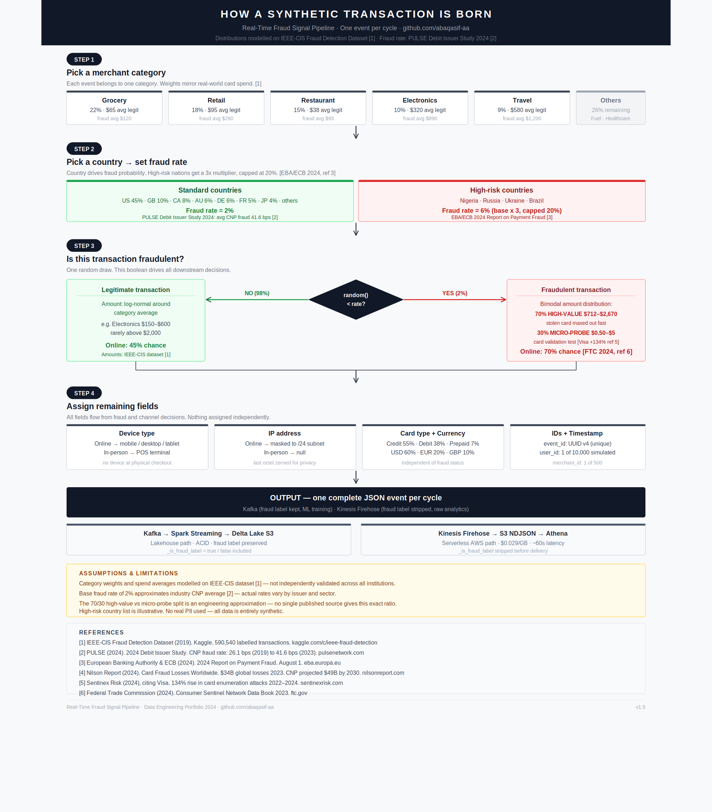

# Real-Time Fraud Signal Pipeline

> A production-grade streaming fraud detection platform processing synthetic card transactions in real time — covering real-time ingestion, lakehouse storage, data quality, ML inference, and AWS-native governance.

[](https://python.org)
[](https://spark.apache.org)
[](https://delta.io)
[](https://aws.amazon.com)
[](https://greatexpectations.io)
[](https://terraform.io)

---

## Business Problem

Card fraud costs the global financial industry **$34 billion annually** (Nilson Report, 2024). Detection systems must:

- Process thousands of transactions per second with sub-second latency
- Flag anomalies in real time before authorization completes
- Explain *why* a transaction was flagged — regulators and analysts need reasoning, not just scores
- Maintain a complete audit trail for compliance and model governance

This pipeline addresses all four requirements.

---

## Architecture

```
┌─────────────────────────────────────────────────────────────────────────┐
│  INGESTION + CDC                                                        │
│                                                                         │
│  [Synthetic Generator] ──► [Schema Registry] ──► [Kafka: transactions.raw]
│   100 events/sec · Avro   FULL compatibility      3 partitions · MSK   │
│   2% fraud rate           schema ID embedded      Snappy compression   │
│                                                                         │
│  [PostgreSQL OLTP] ──► [Debezium CDC] ──► [Kafka: fraud_db.public.*]   │
│   WAL logical repl.    before/after/op/lsn    MSK Connect in prod      │
│                                                                         │
│                    └──► [Kinesis Firehose] ──► [S3 raw NDJSON]          │
│                           Serverless AWS path    $0.029/GB              │
└──────────────────────────────────┬──────────────────────────────────────┘
                                   │
┌──────────────────────────────────▼──────────────────────────────────────┐
│  PROCESSING                                                             │
│                                                                         │
│  [Spark Structured Streaming 3.5]                                       │
│   30s micro-batches · Avro deserialization · foreachBatch DQ           │
│                                                                         │
│   Bronze (S3/Delta) ──────► Silver (S3/Delta, partitioned by date)      │
│   Raw · Immutable           DQ flags · Derived columns · Risk signals   │
└──────────────────────────────────┬──────────────────────────────────────┘
                                   │
┌──────────────────────────────────▼──────────────────────────────────────┐
│  QUALITY                                                                │
│                                                                         │
│  Level 1 — Inline (every micro-batch via foreachBatch)                  │
│    Null rates · Amount bounds · Category enum · Threshold alerting      │
│                                                                         │
│  Level 2 — Full GE Suite (scheduled via Airflow)                        │
│    15 expectations · SparkDFDataset · Results → S3 + PostgreSQL         │
│    Blocks ML retraining if pass rate < 95%                              │
└──────────────────────────────────┬──────────────────────────────────────┘
                                   │
┌──────────────────────────────────▼──────────────────────────────────────┐
│  ML LAYER                                                               │
│                                                                         │
│  [Isolation Forest]  [MLflow Tracking]  [SHAP Explainability]           │
│   Trained on silver   Experiment log     Top-3 features per flag        │
│   dq_passed=true      Model registry     Analyst-readable reasoning     │
│   records only        Staged promotion                                  │
│                                                                         │
│  Gold Layer: fraud_score · is_anomaly · top_feature_1/2/3               │
└──────────────────────────────────┬──────────────────────────────────────┘
                                   │
┌──────────────────────────────────▼──────────────────────────────────────┐
│  AWS SERVICES (11 total)                                                │
│                                                                         │
│  S3 · Glue Data Catalog · Athena · Lambda · Step Functions              │
│  EventBridge · Lake Formation · SNS · SES · CloudWatch · Firehose       │
└─────────────────────────────────────────────────────────────────────────┘
```

---

## Technology Stack

| Layer | Technology | Why This Choice |
|---|---|---|
| Ingestion | Apache Kafka + Kinesis Firehose | Kafka for full lakehouse path with consumer group flexibility and replay; Firehose for serverless direct-to-S3 delivery where broker overhead is unnecessary |
| Processing | Spark Structured Streaming 3.5 | Industry standard for large-scale streaming ETL; native Delta Lake integration |
| Storage format | Delta Lake on S3 | ACID transactions on object storage; time travel for audit; schema evolution without downtime |
| Data quality | Great Expectations + inline Spark | Two-tier quality: fast inline checks every batch, full GE suite on schedule |
| ML | Isolation Forest + SHAP | Unsupervised — no labeled data required at inference; SHAP provides regulator-ready explanations |
| Experiment tracking | MLflow | Model versioning, staged promotion, reproducible training runs |
| Orchestration | Apache Airflow + AWS Step Functions | Airflow for local compute jobs; Step Functions for AWS-native service coordination |
| Governance | AWS Lake Formation | Column-level security — analysts query fraud scores without seeing raw PII |
| Serving | AWS Athena + Streamlit | Serverless SQL for analytics; real-time dashboard for fraud analysts |
| Infrastructure as Code | Terraform | Provisions Glue database, crawler, ETL job, and IAM roles — full destroy and recreate in under 30 seconds |
| Schema Registry | Confluent Schema Registry (local) + AWS Glue Schema Registry | Avro schema versioning, FULL compatibility enforcement, schema ID embedded in every Kafka message |
| CDC | Debezium + Kafka Connect | Captures PostgreSQL WAL changes as Kafka events — before/after/op/lsn — maps to MSK Connect + Aurora in production |

---

## AWS Services

| Service | Role | Monthly Cost |
|---|---|---|
| S3 | Delta Lake storage — bronze, silver, gold layers | ~$0.05 |
| Kinesis Firehose | Serverless streaming direct to S3 | ~$0.61 (4 hrs/day) |
| Glue Data Catalog | Table metadata — makes Delta tables queryable by Athena | $0.00 (free tier) |
| Athena | Serverless SQL on Delta Lake — partition-filtered queries | ~$0.00 |
| Lambda | S3 trigger, DQ pre-check, model promotion audit | $0.00 (free tier) |
| Step Functions | ML retraining orchestration state machine | $0.00 (free tier) |
| EventBridge | Weekly scheduled trigger for retraining pipeline | $0.00 (free tier) |
| Lake Formation | Column-level PII security on Glue tables | $0.00 (free) |
| SNS + SES | Pipeline alerting on DQ failure or fraud spike | $0.00 (free tier) |
| CloudWatch | Custom metrics and alarms | $0.00 (free tier) |
| **Total** | | **~$0.66/month** |

---

## Key Engineering Decisions

### Why two ingestion paths?

Kafka (local Docker) maps directly to AWS MSK in production and gives full consumer group flexibility — multiple Spark jobs, monitoring consumers, and replay capability can all read the same topic independently. Kinesis Firehose provides a complementary serverless path for direct-to-S3 delivery where transformation complexity is low and broker overhead is unnecessary. The two paths serve different production use cases rather than being interchangeable.

### Why Delta Lake over Iceberg?

Both solve ACID transactions on object storage. Delta Lake was chosen for its native Spark integration (zero configuration), mature Python ecosystem, and stronger adoption in Spark-heavy environments. In a Snowflake or AWS Glue-native environment, Iceberg would be the natural fit.

### Why Isolation Forest over supervised models?

Fraud patterns drift. A supervised classifier trained on labeled historical fraud becomes stale as attack vectors evolve. Isolation Forest detects statistical anomalies without requiring labels — closer to how production fraud teams operate before accumulating enough confirmed labels to train a classifier. SHAP explainability compensates for the reduced interpretability of unsupervised models and provides the regulator-ready reasoning that financial institutions require.

### Why two-tier data quality?

Level 1 (inline foreachBatch) catches critical failures within 30 seconds — null spikes, schema drift, amount violations. Acts as a smoke detector. Level 2 (scheduled GE suite) validates full distributions hourly — fraud rate drift, category distribution, mean amount anomalies. Acts as a thorough inspection. A single approach would either be too slow to catch critical failures or too expensive to run continuously at scale.

### Why Terraform for infrastructure?

All Glue infrastructure — IAM roles, Data Catalog database, crawler, and ETL job — is declared in Terraform rather than maintained manually in the AWS console. The full environment can be destroyed and recreated with two commands. Scripts live in Git and are uploaded to S3 by Terraform on deploy, making the infrastructure reproducible across environments without manual steps. In a production team this Terraform code would run through a CI/CD pipeline on every merge to main.

### Why Great Expectations over Deequ?

AWS Glue Data Quality uses Apache Deequ under the hood. GE was chosen because it is Python-native, cloud-agnostic (same code runs on AWS, GCP, or on-prem), and more widely adopted across cloud-agnostic data platforms. In an AWS-only environment, Glue Data Quality would be the natural choice and is architecturally equivalent.

---

## Data Contract

Schema agreement between the event producer and Spark consumer is defined in `data_contracts/transaction_events_v1.yml`. Any producer change that violates this contract must bump the version and pass through the GE quality gate before reaching the ML training pipeline.

Key rules enforced at runtime:

| Field | Rule | Contract Reference |
|---|---|---|
| `event_id` | Non-null, UUID v4, globally unique | Required field |
| `amount` | Between $0.01 and $50,000 | transaction_events_v1.yml |
| `merchant_category` | In defined enum (10 categories) | transaction_events_v1.yml |
| `country_code` | 2-character ISO 3166-1 alpha-2 | transaction_events_v1.yml |
| Overall null rate | Less than 1% on required fields | Pipeline SLA |

---

## Schema Violation Quarantine

Records failing schema validation are written to a quarantine path in S3 (`s3://…/dlq/transactions/`) rather than being silently dropped or crashing the pipeline. Each quarantined record includes:

- **Original raw JSON preserved** — nothing is silently dropped
- **Kafka partition + offset recorded** — enables exact replay after fix
- **Violation summary** — which fields failed, which rules were violated
- **Detected timestamp and date partition** — queryable via Athena

A schema drift incident can be fully investigated and replayed without data loss — the Kafka partition and offset recorded with each quarantined record allow exact replay once the upstream producer is fixed. Every transaction is preserved regardless of whether it passed validation.

---

## Lake Formation Security Model

Three consumer roles with column-level access control:

| Role | Tables | PII Access |
|---|---|---|
| `data-engineers` | All tables | Full access including `ip_address` |
| `data-analysts` | Silver + Gold | `ip_address` blocked |
| `ml-engineers` | Silver only | `ip_address` blocked |

Analysts can query fraud scores and SHAP explanations without seeing raw IP addresses — the governance pattern required before any client data platform goes to production in a regulated financial environment.

---

## Data Generation



Statistical distributions are modelled on the IEEE-CIS Fraud Detection Dataset (Kaggle, 590K real transactions). Base fraud rate of 2% reflects the industry CNP average (PULSE Debit Issuer Study 2024). No real PII is used — all data is entirely synthetic.

---

## Current State

This project is under active development. The table below reflects what is built, tested, and running versus what is planned.

| Component | Status | Notes |
|---|---|---|
| Synthetic event generator | ✅ Complete | 100 eps, 2% fraud rate, burst simulation |
| Kafka producer — Avro | ✅ Complete | fastavro · Confluent wire format · schema ID embedded |
| Confluent Schema Registry | ✅ Complete | Docker · FULL compatibility · schema cached per executor |
| AWS Glue Schema Registry | ✅ Complete | Console learning · versioning · compatibility modes explored |
| Spark Structured Streaming | ✅ Complete | Avro deserialization · Bronze + Silver Delta Lake on S3 |
| Per-batch inline DQ validation | ✅ Complete | foreachBatch — null rate, amount bounds, category enum |
| Great Expectations suite | ✅ Complete | 15 expectations, SparkDFDataset, 257K records validated |
| DQ results → S3 + PostgreSQL | ✅ Complete | JSON audit trail in S3, dq_run_log table populated |
| Schema violation quarantine | ✅ Complete | S3 dlq/ · raw JSON + Kafka offset preserved · replay-ready |
| Schema evolution (mergeSchema) | ✅ Complete | Pipeline handles new columns without downtime |
| S3 bucket setup script | ✅ Complete | Idempotent — safe to run multiple times |
| Docker Compose stack | ✅ Complete | Kafka, Zookeeper, Spark, Schema Registry, Debezium, PostgreSQL, MLflow |
| Data contract YAML | ✅ Complete | transaction_events_v1.yml |
| Glue Data Catalog — manual | ✅ Complete | Database, table, crawler, ETL job via console |
| Glue Data Catalog — Terraform | ✅ Complete | IAM role, database, crawler, ETL job as code |
| Athena analytics queries | ✅ Complete | 5 queries — fraud rate, category, hour, CNP split, DQ trend |
| Glue ETL job (Silver → Gold) | ✅ Complete | Visual ETL + PySpark script in Git |
| Quarantine replay script | 🔄 Planned | replay.py — read quarantine → re-produce to Kafka |
| CDC (Debezium) | ✅ Complete | Debezium 2.5 · PostgreSQL WAL · fraud_signals + dq_run_log topics · auto-registered via debezium-init |
| Exactly-once semantics | 🔄 Planned | MERGE pattern + checkpoint order fix |
| Stateful streaming | 🔄 Planned | Velocity detection · mapGroupsWithState |
| Column lineage (OpenLineage) | 🔄 Planned | Marquez in Docker |
| BCBS239 documentation | 🔄 Planned | Compliance mapping to pipeline components |
| ML training pipeline | 🔄 Planned | Isolation Forest + SHAP + MLflow |
| Real-time inference → gold layer | 🔄 Planned | score_stream.py |
| Kinesis Firehose path | 🔄 Planned | producer.py scaffolded |
| Lambda functions | 🔄 Planned | 3 functions scaffolded |
| Step Functions state machine | 🔄 Planned | deploy.py scaffolded |
| Airflow retraining DAG | 🔄 Planned | fraud_retraining_dag.py scaffolded |
| Streamlit dashboard | 🔄 Planned | app.py in progress |
| Lake Formation security | 🔄 Planned | setup.py scaffolded |
| Redshift Spectrum | 📄 Documented | Architecture + interview talking points only |

---

## Quick Start

### Prerequisites

- Docker Desktop with WSL2 backend
- AWS CLI configured (`aws configure`)
- AWS account with S3, Glue, and Athena permissions

### 1. Clone and configure

```bash
git clone https://github.com/abaqasif-aa/fraud-signal-pipeline.git
cd fraud-signal-pipeline
cp .env.template .env
# Edit .env — add your AWS credentials and region

# Required — Docker Compose reads .env from the docker directory
ln -s ../../.env infrastructure/docker/.env
```

### 2. Provision Glue infrastructure

```bash
cd infrastructure/terraform
terraform init
terraform apply
```

This creates the IAM role, Glue database, crawler, and ETL job in AWS. Safe to run multiple times.

### 3. Create S3 infrastructure

```bash
cd infrastructure/docker
docker compose up -d utils
docker exec utils python3 /app/infrastructure/aws/setup_s3.py
```

### 4. Start all services

```bash
docker compose up -d
```

Services available:

| Service | URL | Purpose |
|---|---|---|
| Kafka UI | http://localhost:8080 | Browse topics and live messages |
| Schema Registry | http://localhost:8081 | Avro schema versions and compatibility |
| MLflow | http://localhost:5000 | Experiment tracking and model registry |
| PostgreSQL | localhost:5433 | Fraud signals and DQ run log |

### 5. Verify CDC is running

```bash
# Check Debezium connector status
curl http://localhost:8083/connectors/fraud-postgres-connector/status

# Verify CDC topics exist
docker exec kafka kafka-topics --bootstrap-server kafka:29092 --list | grep fraud_db

# Consume a CDC event
docker exec kafka kafka-console-consumer \
  --bootstrap-server kafka:29092 \
  --topic fraud_db.public.fraud_signals \
  --from-beginning --max-messages 1
```

### 6. Verify data is flowing

```bash
# Watch Kafka UI at http://localhost:8080 → topics → transactions.raw → messages

# Verify Delta Lake files in S3
aws s3 ls s3://$S3_BUCKET/silver/transactions/ --recursive | head -20
```

### 7. Run data quality validation

```bash
docker exec spark spark-submit \
  --packages org.apache.spark:spark-sql-kafka-0-10_2.12:3.5.0,\
             io.delta:delta-spark_2.12:3.1.0,\
             org.apache.hadoop:hadoop-aws:3.3.4 \
  /app/validate_silver.py
```

### 8. Train the fraud detection model

```bash
docker exec spark spark-submit \
  --packages io.delta:delta-spark_2.12:3.1.0,\
             org.apache.hadoop:hadoop-aws:3.3.4 \
  /app/train.py
```

---

## Project Structure

```
fraud-signal-pipeline/
├── data_contracts/
│   └── transaction_events_v1.yml       # Schema agreement: producer ↔ consumer
├── docs/
│   └── architecture/
│       └── fraud_event_generation_flow.png
├── ingestion/
│   ├── generator/
│   │   ├── generator.py                # Synthetic event generator
│   │   ├── kafka_producer.py           # Kafka producer (Docker)
│   │   └── Dockerfile
│   └── firehose/
│       ├── producer.py                 # Kinesis Firehose producer
│       ├── dual_producer.py            # Parallel Kafka + Firehose
│       └── setup.py                    # Firehose stream provisioning
├── processing/
│   └── spark/
│       ├── streaming_job.py            # Kafka → Delta Lake (bronze + silver)
│       ├── validate_silver.py          # Great Expectations validation suite
│       └── Dockerfile
├── ml/
│   ├── training/
│   │   └── train.py                    # Isolation Forest + SHAP + MLflow
│   └── inference/
│       └── score_stream.py             # Real-time scoring → gold layer
├── orchestration/
│   └── dags/
│       └── fraud_retraining_dag.py     # Airflow weekly retraining DAG
├── infrastructure/
│   ├── aws/
│   │   ├── setup_s3.py                 # S3 bucket + lifecycle setup (idempotent)
│   │   ├── glue_catalog.py             # Glue table registration
│   │   ├── athena_queries.py           # Pre-built analytics queries
│   │   ├── lake_formation/
│   │   │   └── setup.py               # Column-level security setup
│   │   ├── lambda/                     # Lambda functions (3 functions)
│   │   ├── step_functions/             # State machine definition
│   │   └── eventbridge/               # Scheduled trigger rule
│   ├── terraform/
│   │   ├── main.tf                     # IAM role, Glue database, crawler, ETL job
│   │   ├── provider.tf                 # AWS provider configuration
│   │   ├── variables.tf                # Project, bucket, region, database variables
│   │   └── outputs.tf                  # Role ARN, crawler name, job name
│   ├── aws/glue/jobs/
│   │   └── fraud_silver_to_gold_summary.py  # PySpark ETL script
│   └── docker/
│       ├── docker-compose.yml          # Full local stack (9 services)
│       ├── cdc_setup.sh               # Debezium connector registration (auto-called by debezium-init)
│       ├── Dockerfile.utils            # Utility container for AWS scripts
│       └── init.sql                    # PostgreSQL schema + views
├── monitoring/
│   ├── cloudwatch_metrics.py           # Custom CloudWatch metrics
│   └── alerting.py                     # SNS + SES alert publisher
└── dashboard/
    └── app.py                          # Streamlit fraud monitoring dashboard
```

---

## Validation Results

Running against 257,733 real streaming records:

```
Status:              PASSED
Pass rate:           100.0%
Expectations run:    15
Expectations passed: 15
Expectations failed: 0
Total records:       257,733
```

Per-batch inline validation runs every 30 seconds:

```
Batch 198 | records=77,960 | pass_rate=100.0% | fraud_rate=2.0% | null_rate=0.000%
Batch 199 | records=2,081  | pass_rate=100.0% | fraud_rate=2.1% | null_rate=0.000%
```

---

## Design Highlights

### Governance and compliance

A formal data contract layer and two-tier quality gate provide the governance scaffolding required before any data platform goes to production in a regulated environment. The schema quarantine layer ensures no data is silently lost when schemas drift, and the Lake Formation security model means analysts can query fraud signals without accessing raw PII — addressing audit trail requirements that financial regulators expect.

### Distributed systems

Spark Structured Streaming with Delta Lake ACID guarantees on S3, per-partition checkpoint tracking, and foreachBatch for atomic write-plus-validate. The architecture scales horizontally — Kafka partition count maps directly to Spark executor parallelism, and Delta Lake's transaction log handles concurrent writes without coordination overhead. Schema evolution via mergeSchema allows upstream changes without pipeline downtime.

### AWS cloud architecture

Eleven AWS services integrated into a coherent lakehouse architecture — S3 as the storage foundation, Glue for metadata management, Athena for serverless analytics, Lambda for event-driven triggers, and Lake Formation for fine-grained access control. Total cost: ~$0.66/month, demonstrating cost-aware cloud design.

### Infrastructure as code

All Glue infrastructure is declared in Terraform — IAM roles, Data Catalog database, crawler with Delta Lake-specific exclusion patterns, and ETL job pointing to a versioned PySpark script in S3. The full environment can be destroyed and recreated with `terraform destroy` and `terraform apply` in under 30 seconds. This eliminates manual console steps from the reproducibility path and maps directly to how production infrastructure is managed at scale.

### Schema enforcement and CDC

Avro serialization with Confluent Schema Registry enforces the data contract at the wire level — every message produced to Kafka carries a schema ID in its header. The consumer fetches the schema once per version and caches it, adding zero per-message latency. FULL compatibility mode ensures breaking changes are rejected at registration time rather than discovered at runtime when consumers crash. Debezium CDC captures every INSERT, UPDATE, and DELETE from PostgreSQL as a structured event with before/after images and the WAL LSN — enabling exact replay from any point in the transaction log. In production this maps directly to MSK Connect + Aurora PostgreSQL with the same connector configuration.

### ML explainability

Isolation Forest detects statistical anomalies without requiring labeled training data — critical in production fraud environments where labeled datasets are limited. SHAP feature importance provides analyst-readable explanations per flagged transaction, addressing the explainability requirements of regulated financial environments.

---

## Assumptions and Limitations

- Statistical distributions modelled on IEEE-CIS Fraud Detection Dataset (Kaggle) — not independently validated across all institutions
- Base fraud rate of 2% approximates the industry CNP average — actual rates vary by issuer and merchant sector
- The 70/30 high-value vs micro-probe fraud split is an engineering approximation — no single published source gives this exact ratio
- Compute runs locally in Docker to control cost — maps directly to AWS MSK, EMR, and RDS in production without code changes
- No real PII used — all user, merchant, and transaction data is entirely synthetic

---

## References

1. IEEE-CIS Fraud Detection Dataset (2019). Kaggle. 590,540 labelled transactions. kaggle.com/c/ieee-fraud-detection
2. PULSE (2024). 2024 Debit Issuer Study. CNP fraud rate: 26.1 bps (2019) → 41.6 bps (2023). pulsenetwork.com
3. European Banking Authority & ECB (2024). 2024 Report on Payment Fraud. eba.europa.eu
4. Nilson Report (2024). Card Fraud Losses Worldwide. $34B global losses 2023. nilsonreport.com
5. Sentinex Risk (2024), citing Visa. 134% increase in card enumeration attacks 2022–2024. sentinexrisk.com
6. Federal Trade Commission (2024). Consumer Sentinel Network Data Book 2023. ftc.gov

---

## Author

**Abaq Asif** — Data Engineering & Analytics Manager

[](https://linkedin.com/in/abaqasif)
[](https://github.com/abaqasif-aa)
[](https://medium.com/@abaqasif)
